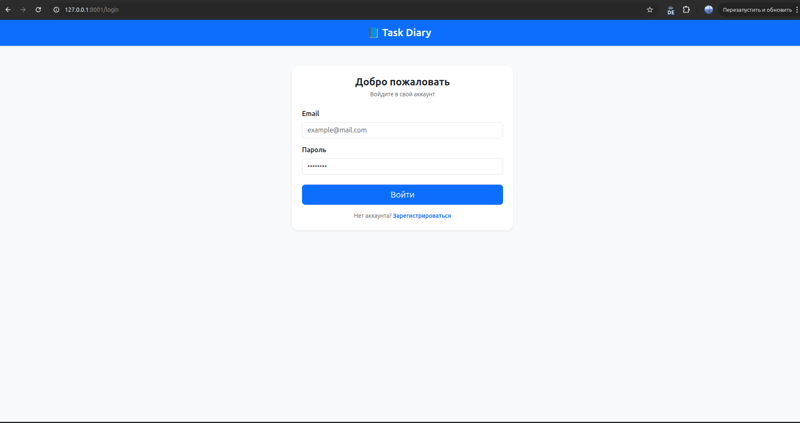
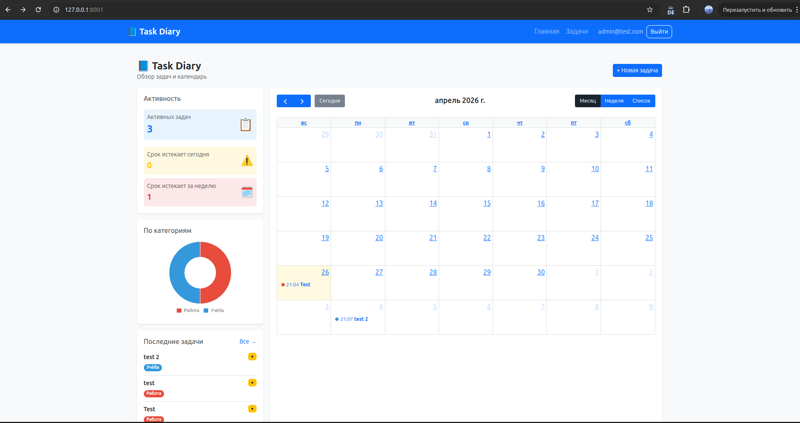
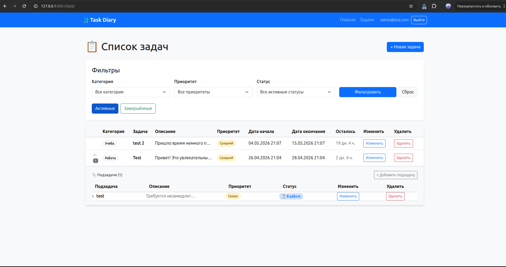
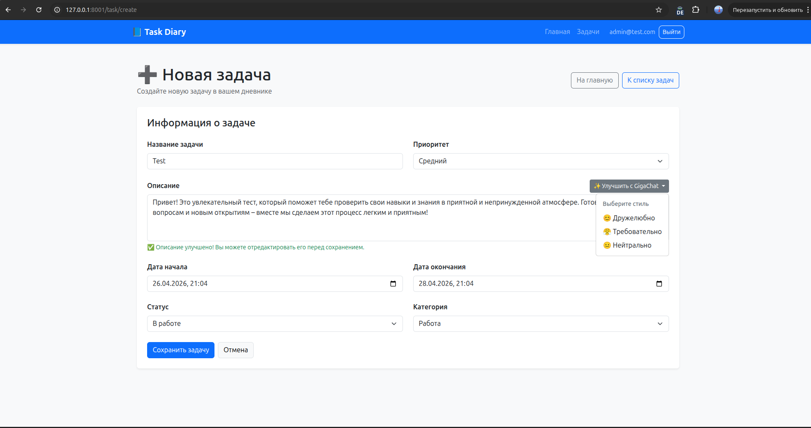
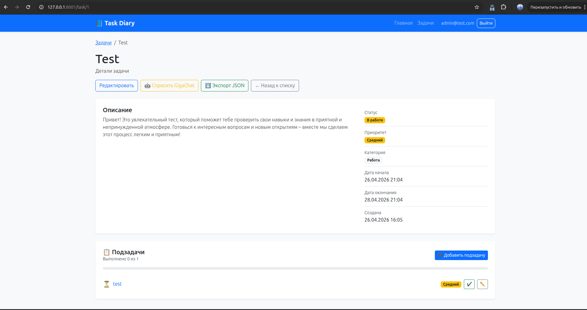

# TaskDiary 📋


> Веб-приложение для управления задачами с поддержкой подзадач, категорий, приоритетов и аналитики.

---

## 📸 Скриншоты

### 🔐 Страница входа


### 📊 Дашборд


### 📋 Список задач


### ➕ Создание задачи


### 🔍 Детали задачи


---

## ✨ Возможности

- ✅ **Задачи и подзадачи** — иерархическая структура задач
- 🏷️ **Категории** — группировка задач по категориям с цветовой маркировкой
- 🔥 **Приоритеты** — низкий / средний / высокий
- 📊 **Аналитика** — графики продуктивности, статистика
- 📅 **Календарь** — визуализация задач по датам
- 🔐 **Аутентификация** — регистрация и вход пользователей
- 🛡️ **Безопасность** — CSRF-защита, Voter-авторизация
- 📤 **Экспорт** — выгрузка задач в JSON
- 🤖 **GigaChat AI** — встроенный AI-ассистент для работы с задачами

---

## 🛠️ Технологии

| Технология | Версия | Назначение |
|------------|--------|------------|
| PHP | 8.2+ | Язык программирования |
| Symfony | 7.x | Основной фреймворк |
| Doctrine ORM | 3.x | Работа с базой данных |
| MySQL | 8.0 | База данных |
| Twig | 3.x | Шаблонизатор |
| Bootstrap | 5.x | UI-компоненты |
| Chart.js | 4.x | Графики и аналитика |
| FullCalendar | 6.x | Календарь задач |
| PHPStan | level 6 | Статический анализ |
| PHP CS Fixer | 3.x | Стиль кода PSR-12 |

---

## 🚀 Установка

### Требования

- PHP 8.2+
- Composer
- MySQL 8.0+
- Symfony CLI

### Шаги

1. **Клонировать репозиторий**

```bash
git clone https://github.com/your-username/taskdiary.git
cd taskdiary
